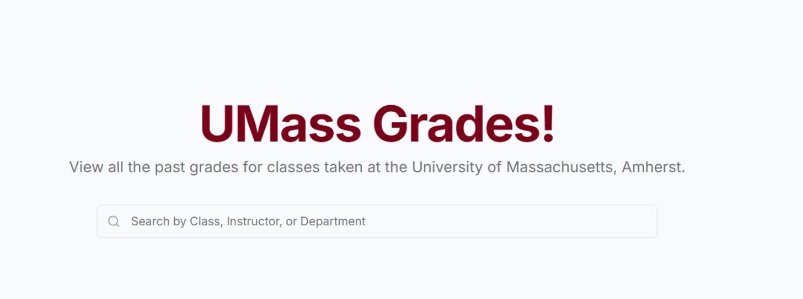
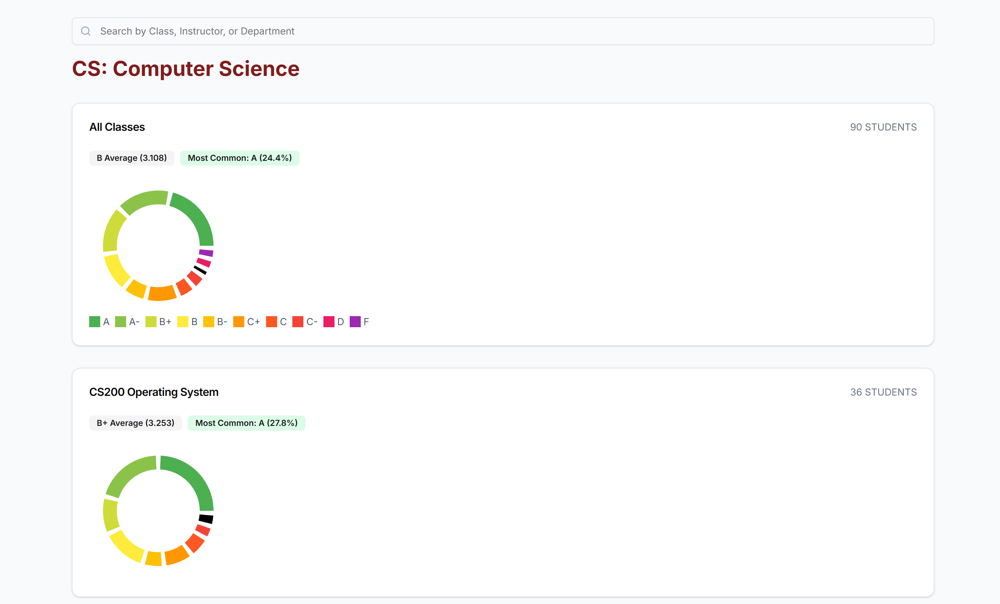

<!DOCTYPE html>
<html lang="en">
<head>
    <meta charset="UTF-8">
    <meta name="viewport" content="width=device-width, initial-scale=1.0">
</head>
<body>
    
    
    <h1>UMassGrades</h1>
    
<strong>UMassGrades</strong> is a web application that allows University of Massachusetts
    students to look at previous years' grade distributions for their classes
    

    <h2>Inspiration</h2>

We drew inspiration from <a href="https://github.com/samyok/gophergrades">GopherGrades</a>, a platform widely used at the 
University of Minnesota that has over 50,000 users. Noticing that UMass Amherst lacks a similar resource, we wanted to create 
a tool to help students make more informed decisions 
when choosing courses or instructors. Our platform will enable students to view grade distributions, averages, and most common 
grade for each course and professor—information that can play a crucial role in academic planning.

    <h2>Features</h2>

Our platform replicates and enhances the functionalities found on Gopher Grades. Users can type a course code/name, professor name,
or department into the search bar to quickly access relevant results. For each course, users can view the instructors who have taught it, 
along with detailed grade distributions, the average grade, and the most common grade. If a professor is searched, students can view all courses
taught by that professor, along with similar grade data. Departmental searches are also supported, making it easy for users to explore courses within
a particular field. This tool is designed to give students a comprehensive view of academic history at UMass Amherst

    <ul>
        <li><strong>Grade Distribution by Course</strong>: Access grade distribution data by course code, course name, professor, or department</li>
        <li><strong>Instructor Comparison</strong>: Compare grading trends between different instructors within the same course.</li>
        <li><strong>Data Visualization</strong>: Generate visualizations, such as histograms or scatter plots, of grading trends over time.</li>
    </ul>
<h2>How we Built it:</h2>

We developed the frontend using <strong>Next.js</strong> with <strong>JavaScript, HTML, CSS, and Tailwind CSS</strong> for styling, and built the backend with <strong>Java Spring Boot and Spring JDBC</strong>.
We containerized the application using <strong>Docker</strong> to ensure easy deployment, and we use <strong>PostgreSQL</strong> as our database. Since we don’t yet have access to real UMass grade data,
we generated mock data using the <strong>JavaFaker library</strong>, creating realistic sample records for courses, professors, and departments. To enhance the user experience, we
implemented debouncing in the search bar, which optimizes performance by reducing unnecessary search operations as users type. This allows for faster, more responsive 
searching across classes and professors, delivering relevant results efficiently.

    <h2>To run this application locally:</h2>
    <h3>Clone the repository:</h3>
    <pre><code>git clone https://github.com/eurooooo/UMassGrades.git
cd UMassGrades</code></pre>
    <h3>Dependencies to Install:</h3>
<li><a href="https://docs.docker.com/engine/install/">Docker</a></li>

Once installed, confirm it is working by running:

<pre><code>docker run hello-world</code></pre>
Next, build and start the services defined in the <a href="https://github.com/eurooooo/UMassGrades/blob/main/UMassGrades/docker-compose.yml">docker-compose.yml file</a>:
<pre><code>docker-compose up --build</code></pre>
<li><a href="https://www.oracle.com/java/technologies/javase/jdk17-archive-downloads.html">Java Version 17</a></li>
<li><a href="https://www.jetbrains.com/idea/">IntelliJ IDEA</a></li>
<h3>Setting up the Database:</h3>
<li><a href="https://www.jetbrains.com/idea/">Create a Database Source in Intellij</a></li>
<li>Name the Database "umassgrades"</li>
<li>Username: postgres</li>
<li>Password: secret</li>
<li>Port:5432 (Ensure nothing else is running on this port)</li>
<h3>Running the Backend:</h3>
<li>Within Intellij, run <a href="UMassGrades/src/test/java/com/jemeny/umassgrades/UMassGradesApplicationTests.java">the application</a></li>
    Go to localhost:8080 to confirm it is working (Make sure nothing else is running on that port)
<h3>Running the Frontend:</h3>
<pre><code>npm run dev
npm run install</code></pre>
Go to localhost:3000 to confirm everything is working (Make sure nothing else is running on that port)
<h2>Contributing</h2>
    
We welcome contributions! Please open an issue or submit a pull request if you have a feature idea, bug fix, or enhancement.

    <h3>Development Setup</h3>
    <ol>
        <li>Fork the repository.</li>
        <li>Create a new branch for your feature.</li>
        <li>Make your changes.</li>
        <li>Submit a pull request.</li>
    </ol>
    <h2>License</h2>
    
This project is licensed under the MIT License.
    <h2>Acknowledgments</h2>
    
Thanks to the HackUMass team for putting together an amazing Hackathon and making this project possible

</body>
</html>
